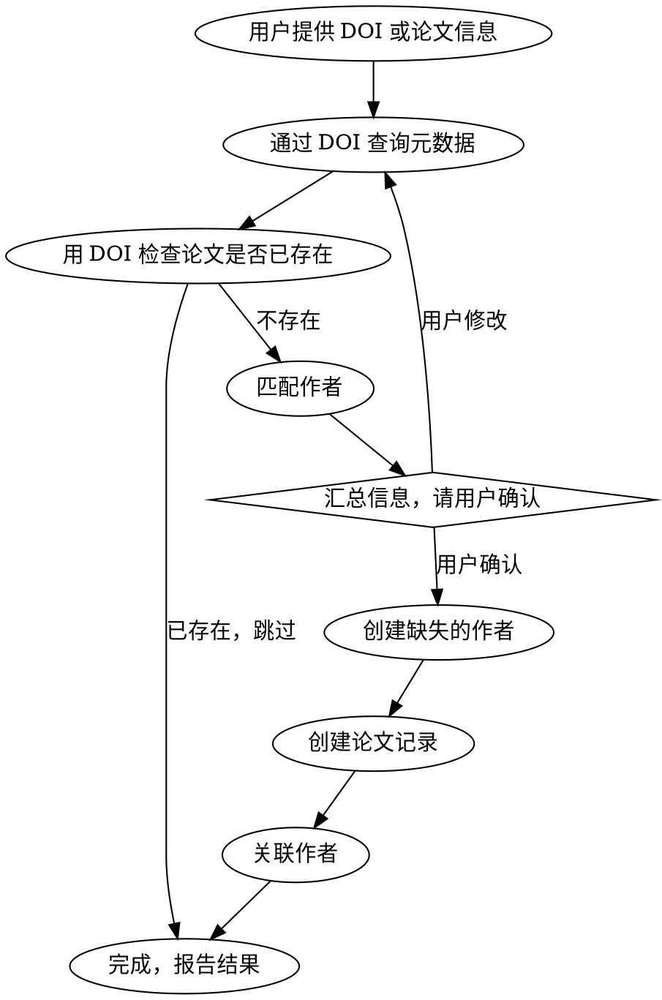

# 录入新论文

通过 DOI 或手动信息录入论文到数据表，自动处理作者查重/创建和关联。

## 数据表

| 表 | ID | 说明 |
|---|---|---|
| 论文 | `cmpnco95t00089rbmfpha27y3` | 论文信息，33 个字段 |
| 作者 | `cmpnco96000099rbm6se9fpr7` | 作者信息，7 个字段 |

## 铁律

**在执行任何写入操作（创建/更新/关联）之前，必须将完整的论文信息和作者匹配结果呈现给用户确认。** 不允许未经确认就写入数据。

## 流程



### Step 1: 获取论文元数据

**有 DOI 时：** 用 curl 或 WebFetch 访问 `https://api.crossref.org/works/{DOI}` 获取元数据。

从 CrossRef 响应中提取：
- `title` → `title_en`（取第一个）
- `container-title` → `venue_name`
- `published.date-parts` → `publish_date`, `publish_year`
- `author` 列表 → 作者英文名
- `volume`, `issue`, `page` → 对应字段
- `DOI` → `doi`
- `ISSN` → `issn_isbn`

也可用 `https://api.openalex.org/works/doi:{DOI}` 作为备选。

**无 DOI 时：** 直接向用户询问必要字段。

### Step 2: 检查论文是否已存在

```
list_records(tableId="cmpnco95t00089rbmfpha27y3", filters={"doi": DOI})
```

若已存在，告知用户并停止。

### Step 3: 匹配作者

**关键：作者表 name_en 存储格式是 "Given Family"（如 "Wen Yao"），而 CrossRef 返回的是 "Family Given"（如 "Yao Wen"）。匹配时必须做格式转换。**

对 CrossRef 返回的每位作者，将 "Family Given" 转为 "Given Family" 后在作者表中搜索。

匹配方法（必须通过 API 查询作者表，不要从论文记录的 authors 字段拷贝 targetRecordId）：

```
# 方法：拉取作者表全部记录，在本地逐个匹配
list_records(tableId="cmpnco96000099rbm6se9fpr7", pageSize=200)
```

在返回的全部作者记录中，对每位论文作者做匹配：
1. 将 CrossRef 的 `"family": "Yao", "given": "Wen"` 组合为 `"Wen Yao"`（Given Family 格式）
2. 在作者表中按 `name_en` 字段精确匹配
3. 如果精确匹配失败，尝试去除空格后的小写匹配（如 `"weienzhou"` vs `"Weien Zhou"` → `"weienzhou"`）

将匹配结果整理为表格展示给用户，标注：
- ✅ 已匹配的作者（显示中文名、英文名、recordId）
- ❌ 未匹配的新作者

### Step 4: 用户确认（强制）

**向用户展示完整的待录入信息，包括：**

1. **论文信息汇总表** — 所有从 DOI 获取 + 推断的字段值
2. **作者匹配结果** — 每位作者的匹配状态
3. **缺失字段提醒** — 列出所有未填写的字段，区分必填和选填

**缺失字段检查清单：**

| 必填（必须确认） | 经常缺失的选填字段 |
|---|---|
| `paper_id` — 论文编号 | `title_cn` — 中文标题 |
| `title_cn` — 中文标题（推荐） | `corr_authors` — 通讯作者 |
| `corr_authors` — 通讯作者 | `group_name` — 所属组 |
| `group_name` — 所属组 | `inst_rank` — 单位排名 |
| `index_type` — 收录类型 | `fund_no` — 基金号 |
| `pub_status` — 刊出状态 | `impact_factor` — 影响因子 |
| | `cas_partition` / `jcr_partition` / `sci_partition` — 分区信息 |

对新作者，必须确认：
- 中文姓名（不能猜测）
- 所属组别
- author_id（可自动编号，取作者表最大 author_id + 1）

**只有用户明确确认后，才执行后续写入步骤。** 用户可能会修改任何字段值或补充缺失信息。

### Step 5: 创建新作者

对未匹配的新作者，按确认信息创建：

```
create_record(
  tableId="cmpnco96000099rbm6se9fpr7",
  data={
    author_id: "A0xxx",
    name_cn: "中文姓名",
    name_en: "Given Family",
    name_norm: "givenfamily",
    group_name: "优化组"
  }
)
```

记录返回的 recordId，用于后续关联。

### Step 6: 创建论文记录

```
create_record(
  tableId="cmpnco95t00089rbmfpha27y3",
  data={ ... }
)
```

**论文字段参考：**

| 字段 | 类型 | 必填 | 说明 |
|------|------|------|------|
| `paper_id` | TEXT | ✅ | 论文编号 |
| `title_en` | TEXT | ✅ | 英文标题 |
| `title_cn` | TEXT | | 中文标题 |
| `paper_type` | SELECT | | journal / conference |
| `publish_year` | NUMBER | | 发表年份 |
| `publish_date` | DATE | | 发表日期（YYYY-MM-DD） |
| `doi` | TEXT | | DOI |
| `venue_name` | TEXT | | 期刊/会议名 |
| `venue_name_cn` | TEXT | | 中文期刊名 |
| `index_type` | SELECT | | SCI / EI / 无 |
| `pub_status` | SELECT | | 已刊出 / 录用待刊 / 未刊出 |
| `corr_authors` | TEXT | | 通讯作者（中文分号分隔） |
| `group_name` | SELECT | | 所属组（优化组/体系组等） |
| `inst_rank` | NUMBER | | 单位排名 |
| `fund_no` | TEXT | | 基金号 |
| `paper_url` | TEXT | | 论文链接 |
| `volume` | TEXT | | 卷 |
| `issue` | TEXT | | 期 |
| `pages` | TEXT | | 页码 |
| `impact_factor` | NUMBER | | 影响因子 |
| `issn_isbn` | TEXT | | ISSN/ISBN |
| `ccf_category` | SELECT | | CCF 分类 |
| `cas_partition` | SELECT | | CAS 分区 |
| `jcr_partition` | SELECT | | JCR 分区 |
| `sci_partition` | SELECT | | SCI 分区 |
| `archive_status` | SELECT | | 归档状态 |

### Step 7: 关联作者

用 `update_record` 一次性关联所有作者（不要逐个 link，`link_records` 工具有验证问题）：

```
update_record(
  tableId="cmpnco95t00089rbmfpha27y3",
  recordId=paper_record_id,
  data={
    paper_id: "xxx",
    title_en: "xxx",  // 必须包含必填字段以通过验证
    authors: [
      {"targetRecordId": "作者1_ID"},
      {"targetRecordId": "作者2_ID"},
      ...
    ]
  }
)
```

**注意：** update_record 的 PATCH 接口会做全量验证，必须同时传入 `paper_id` 和 `title_en` 等必填字段，否则会报 VALIDATION_ERROR。

## 作者名匹配陷阱

| 陷阱 | 说明 |
|------|------|
| 格式不一致 | DB 存 "Given Family"（Wen Yao），CrossRef 返回 "Family Given"（Yao Wen） |
| 不要拷贝论文中的 targetRecordId | 论文记录的 authors 字段中的 targetRecordId 可能因 ID 差异（如隐藏字符）导致关联失败 |
| 中文搜索不可靠 | list_records 的 search 参数对英文名搜索不准，应拉取全部作者记录在本地匹配 |
| 同名作者 | 可能存在同名不同人的情况，匹配到多个时让用户选择 |

## 常见问题

| 问题 | 处理 |
|------|------|
| DOI 查不到元数据 | 回退到手动输入，向用户逐项确认 |
| 作者英文名匹配到多条 | 展示列表让用户选择正确的人 |
| 新作者缺少中文名 | 必须向用户确认后再创建，不要猜测 |
| 论文已存在 | 告知用户，询问是否更新 |
| 用户没提供 paper_id | 提醒这是必填字段，查询当前最大编号 +1 并让用户确认 |
| link_records 报验证错误 | 改用 update_record 一次性关联所有作者 |
